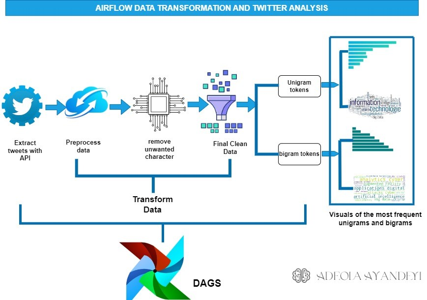

# Twitter Analytics with Airflow (With some Natural Langauge Processing)

This project utilizes Apache Airflow to orchestrate and automate the process of extracting data from Twitter using the Twitter API. The extracted data is then subjected to various transformations, including preprocessing, removal of unwanted characters, and removal of banned words. Finally, the transformed data is loaded into a target destination. As this project is about twitter analytics, further tasks includes the conversion of the data into unigrams and biagrams with natural language processing NLTK to further understand the frequencies of words and their impact. The top 20 unigrams and biagrams are visualized with barchart and wordcloud



## Project Structure

The project is organized into the following components:

- `dags/`: Contains the Airflow DAG (Directed Acyclic Graph) definition file(s) that define the workflow for the data extraction and transformation process.
- `scripts/`: Contains the scripts used for data preprocessing, removal of unwanted characters, removal of banned words, and loading the final data.
- `visualizations/`: Contains the scripts for generating visualizations such as bar charts and word clouds based on the 20 most frequent unigrams and biagrams

## Prerequisites

Before running this project, make sure you have the following prerequisites installed:

- Python 3.x
- Apache Airflow
- Twitter API credentials

## Setup

1. Clone this repository to your local machine.
2. Install the required Python packages by running the following command:
    ```
    pip install -r requirements.txt
    ```
3. Configure your Twitter API credentials by updating the `config.py` file with your own credentials.
4. Start the Airflow scheduler and web server by running the following command:
    ```
    airflow webserver -p 8080
    airflow scheduler
    ```
5. Access the Airflow web interface by navigating to `http://localhost:8080` in your web browser.
6. Enable and trigger the DAG defined in the `dags/` directory to start the data extraction and transformation process.

## Usage

1. Modify the DAG definition file(s) in the `dags/` directory to customize the data extraction and transformation process according to your requirements.
2. Update the scripts in the `scripts/` directory to implement additional preprocessing steps, removal of unwanted characters, removal of banned words, or any other data transformation logic.
3. Customize the visualizations in the `visualizations/` directory to generate different types of visualizations based on the extracted and transformed data.


## License

This project is licensed under the [MIT License](LICENSE).