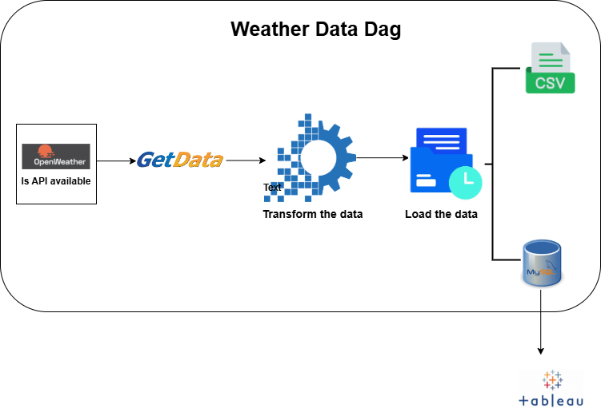
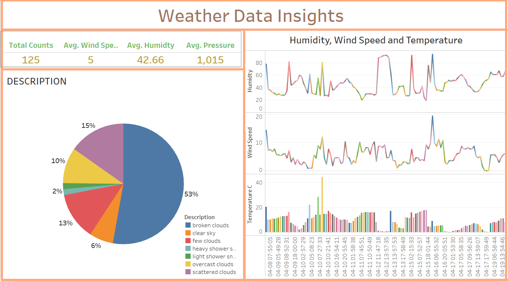
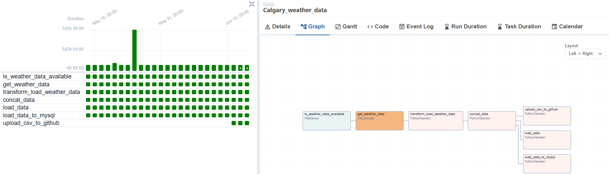

# ETL Data Analysis for Calgary Weather Data with Airflow, MySQL, Git API and Tableau

This project utilizes Apache Airflow and Dbt to orchestrate and automate the availability of Calgary weather data from an Open Weather API, extract the data, transform and load the data in MySQL, and visualize the weather information with Tableau. The data extraction is scheduled hourly, and the resulting files are concatenated into a single CSV file. The data is also loaded into a MySQL database in parallel. The database is connected to Tableau to visualize the weather information.

## Project Overview

The main goal of this project is to automate the process of fetching weather data from an API (Open Weather API) and preparing it for further analysis. The project follows the Extract, Transform, Load (ETL) process to ensure the data is in a usable format. The data is loaded into a Database (MySQL) and visualized with Tableau

## Workflow

1. **Data Extraction**: Airflow triggers a task to fetch weather data from the API at regular intervals (hourly in this case). The extracted data includes various weather parameters such as temperature, humidity, cloud description, wind speed, precipitation, and other information

2. **Data Transformation**: The extracted data is then transformed to ensure consistency and compatibility. This may involve cleaning the data, converting units from Fahrenheit to Celsius, or aggregating data points.

3. **Data Storage**: The transformed data is stored in two formats.
    - Each file extracted represents a specific time period (hourly) and is saved in csv format. All the files are concatenated into a single CSV file in a designated directory.
    - The data are also loaded into MySQL database concurrently. With unique time record, the data loaded is unique and there are no duplicates.
    - The project is updated to load data into GitHub with Git API, which is available for public use.  
    
4. **Visualization**: Finally, MySQL Database is connected to Tableau to visualize the data and extract insights. The dashboard is updated in realtime.
    - The tableau dashboard is shown below:
      
    - The Git API can also be connected to Tableau and/or Power BI to visualize the data.

## NOTE
When running the airflow, the following errors can be fixed:
    - port already in use: If the port number in use is 8080, write code 'sudo lsof -i :8080.
    If a pid number is provided, kill the pid with 'kill -9 <pid>
    - If working on Windows with WSL Ubuntu, to connect to MySQL bench or Tableau, there is a need to change the bind address in order to connect remotely. To do this, follow these steps:

    sudo nano /etc/mysql/mysql.conf.d/mysqld.cnf

    Find bind-address = 127.0.0.1 and change is to 0.0.0.0

    Restart MySQL
    - sudo service mysql restart
    Create MySQL user that can connect remotely

    - sudo mysql -u root -p
    Write the query
    CREATE USER 'new_user'@'%' IDENTIFIED BY 'password';  ## replace 'new_user' and 'password' with yours
    GRANT ALL PRIVILEGES ON *.* 'new_user'@'%' WITH GRANT OPTION;
    FLUSH PRIVILEGES;
    exit MySQL
    In Ubuntu, get the hostname IP address
    hostname -I

    With these information, you can connect Ubuntu's MySQL with MySQL Bench in Windows and Tableau. When connecting, use the hostname IP address ad the hostname, the new user and password for the username and password.

    Here is the airflow graph:

 

## Benefits

- Automation: The use of Airflow allows for the automation of the entire ETL process, reducing manual effort and ensuring data availability on a regular basis.

- Scalability: Airflow's task-based architecture enables easy scaling of the project to handle larger datasets or additional data sources.

- Flexibility: The project can be easily customized to fetch data from different weather APIs or incorporate additional data transformation steps as per specific requirements.

## Getting Started

To get started with this project, follow the steps below:

1. Install Apache Airflow and set up the necessary dependencies.

2. Configure the Airflow DAG (Directed Acyclic Graph) to define the workflow and tasks. Here, the tasks are
 - is_weather_data_available: To check if the API is available for data extraction
 - get_weather_data: Used to get the required data
 - transform_load_weather_data: A comprehensive Python code is written to transform the data
 - concat_data: Each file for each duration is concatenated and sorted with the latest time in descending order 
 - load_data: Data is loaded as a single CSV file
 - load_data_to_mysql: Data is loaded into the MySQL Database

 The dependencies are defined as below:

- is_weather_data_available >> get_weather_data >> transform_load_weather_data >> concat_data >> load_data
- concat_data >> load_data_to_mysql

3. Implement the data extraction, transformation, and storage tasks using appropriate Python libraries and APIs.

4. Test the workflow by running Airflow locally or deploying it to a production environment.

For detailed instructions and code examples, refer to the project documentation.

## Conclusion

By leveraging Apache Airflow, this project provides a robust and automated solution for fetching, transforming, and storing and visualizing weather data. 
