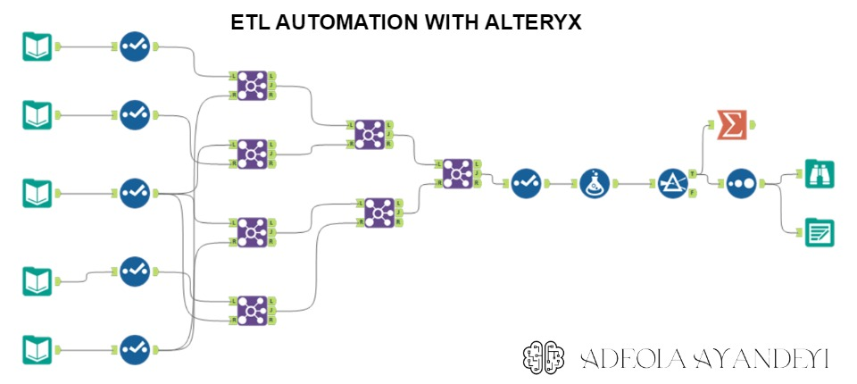

# ETL Workflow Documentation

## Overview
This project is an ETL (Extract, Transform, Load) workflow created in Alteryx. It involves processing data from multiple sources, such as CSV and JSON files, performing various transformations, and loading the output as a CSV file.

## Workflow Steps
1. **Data Extraction**: The workflow starts by extracting data from multiple sources, including CSV, directory with multiple files and JSON files. The data is read into Alteryx for further processing.

2. **Data Joining**: The extracted data is then joined together based on specified criteria. This step combines data from different sources into a single dataset.

3. **Data Transformation**: After the data is joined, various transformations are applied to manipulate and shape the data. This may include selecting specific fields, filtering out unwanted records, and sorting the data based on certain criteria.

4. **Data Loading**: Once the data is transformed, it is loaded into the output file format, which in this case is a CSV file. The transformed data is written to the CSV file, ready for further analysis or use in other systems.

## Dependencies
- Alteryx: This workflow is built using Alteryx, a powerful data integration and analytics platform. Make sure you have Alteryx installed to run this workflow.

## Usage
To use this ETL workflow, follow these steps:
1. Open Alteryx and import the workflow file.
2. Configure the input data sources by specifying the file paths or connections.
3. Adjust any transformation steps as needed, such as selecting fields or applying filters.
4. Specify the output file path for the CSV file.
5. Run the workflow to execute the ETL process.
6. Once the workflow completes, check the specified output file for the transformed data.

## Conclusion
This ETL workflow in Alteryx provides a comprehensive solution for processing data from multiple sources, performing transformations, and loading the output as a CSV file. It offers flexibility and ease of use, allowing users to customize the workflow based on their specific requirements.