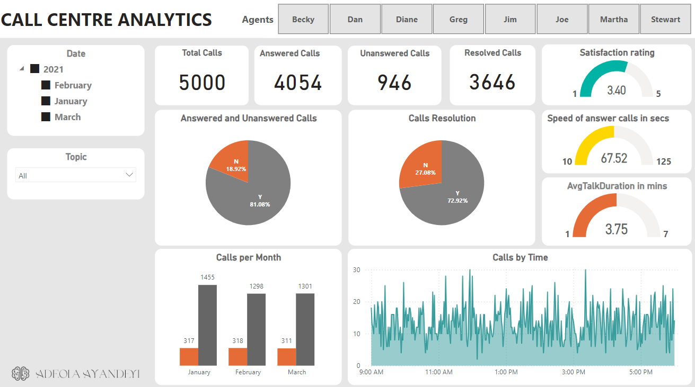

## Call Center Analytics
This project analyzes the Key Performance Matrics of Agents in a call centre to improve customer satisfaction and operational efficiency. Here are the details of the analysis

Satisfaction Ratings: This metric measures the level of satisfaction expressed by customers after their calls with the call center. It is usually represented as a numerical rating or a scale (e.g., 1-5 stars). Higher satisfaction ratings indicate that customers are more satisfied with the service provided by the call center.

Average Talk Durations in Minutes: This metric calculates the average duration of each call in minutes. It provides insights into the average length of conversations between the agents and customers. Monitoring this metric can help identify trends or patterns in call durations, which can be useful for optimizing call center operations and resource allocation.

Total Calls: This metric represents the total number of calls received by the call center during a specific period. It provides an overall measure of call volume and can be used to track the workload and demand on the call center.

Total Answered and Unanswered Calls: These metrics provide a breakdown of the total calls into two categories: answered and unanswered calls. Answered calls are those that were successfully handled by call center agents, while unanswered calls are those that were not picked up or resolved. Monitoring these metrics helps assess the call center's performance in terms of call handling and customer service.

Total Call Resolutions: This metric measures the number of calls that were successfully resolved by call center agents. It indicates the effectiveness of the call center in addressing customer issues or inquiries. A higher number of resolved calls generally indicates better customer service and problem-solving capabilities.

Calls Resolved per Topic: This metric provides insights into the distribution of resolved calls across different topics or categories. It helps identify the most common issues or topics that customers contact the call center about. By analyzing this metric, call center managers can identify areas for improvement, allocate resources accordingly, and provide targeted training to agents based on the specific topics they handle.

These metrics collectively provide a comprehensive view of the call center's performance, customer satisfaction, and operational efficiency. By regularly monitoring and analyzing these metrics, call center managers can make data-driven decisions to improve service quality, optimize resources, and enhance customer experience.